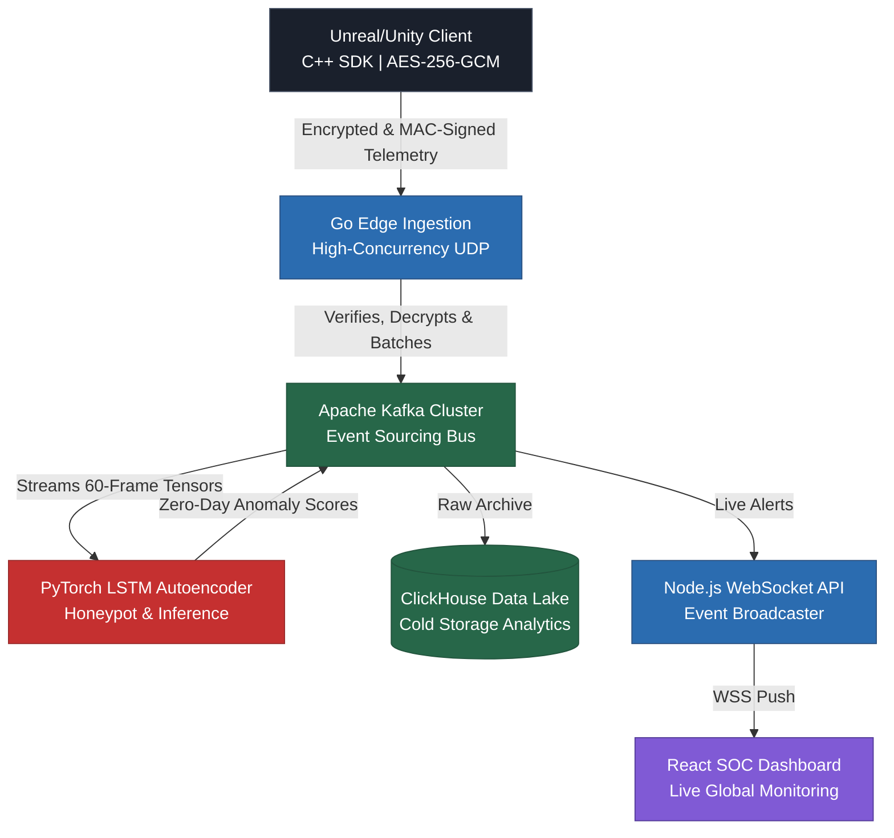

<div align="center">
  
  <h1>SentinelX Enterprise Anti-Cheat Architecture</h1>

  <p><strong>Cryptographically Secure Telemetry • High-Throughput Go Ingestion • Unsupervised PyTorch ML • Kubernetes Autoscaling</strong></p>

  <p>
    <a href="https://Vishwajeet2005.github.io/SentinelX/"><b>View Live SOC Dashboard Demo</b></a>
  </p>

  <p>
    <a href="#overview"></a>
    <a href="#tech-stack"></a>
    <a href="LICENSE"></a>
  </p>
</div>

---

## 📖 Executive Summary

**SentinelX** is a military-grade, cloud-native Anti-Cheat infrastructure engineered for modern, high-concurrency multiplayer environments (Unreal Engine 5, Unity). Designed to protect AAA studios from advanced cheating syndicates, SentinX operates completely out-of-band, guaranteeing **zero performance degradation** on the authoritative game server.

Traditional Anti-Cheats rely on fragile, reactive Signature Scanning (searching memory for known cheat hashes) or intrusive Kernel-Level Ring-0 drivers. SentinX pioneers a **Hybrid Zero-Trust Architecture**. It couples cryptographically secured telemetry pipelines with **Unsupervised Machine Learning** to mathematically detect impossible physics (Aimbots, Speedhacks) in real-time, regardless of the cheat software's signature.

This repository contains the complete microservice architecture, capable of horizontally scaling to support millions of concurrent players.

---

## 🏗️ Core Architecture & Deep Dive

### 1. Zero-Trust C++ Engine SDK
The client-side footprint of SentinX is a lockless, ring-buffer driven C++ SDK engineered to hook directly into the game engine's `Tick()` loop.
* **Microsecond Overhead:** Heavily optimized C++ guarantees `< 0.1ms` overhead per frame, ensuring competitive frame rates remain untouched.
* **AES-256-GCM Payload Encryption:** Telemetry is encrypted client-side using military-grade `AES-256-GCM` in an *Encrypt-then-MAC* configuration. Utilizing a 96-bit randomized Initialization Vector (IV) per packet entirely neutralizes Man-in-the-Middle (MitM) memory tampering, payload spoofing, and replay attacks.
* **HMAC-SHA256 Signing:** Ensures mathematical proof of origin before the edge server allocates any resources to process the packet.

### 2. High-Throughput Go Edge Ingestion (The Frontline)
The ingress layer is built in Go (`1.23`), leveraging its world-class concurrency model (`goroutines`) to handle massive UDP socket saturation.
* **Concurrency Model:** A pool of 100+ worker routines continuously pull cryptographically verified packets from an in-memory 10,000-packet buffer, preventing UDP packet drops during traffic spikes.
* **Replay Cache & Time Dilation Enforcement:** An LRU cache drops duplicate sequence IDs, while strict delta-time validation drops mathematically impossible physics before they reach the ML engine, preventing OOM attacks.
* **Observability:** Fully instrumented with Prometheus endpoints, exporting sub-millisecond network latency and drop-rates directly to Grafana.

### 3. PyTorch ML Pipeline & Deterministic Honeypots
The core detection engine features a hybrid architecture combining probabilistic AI with deterministic mathematical traps.
* **Unsupervised LSTM Autoencoders:** Trained exclusively on *legitimate* human gameplay, the neural network learns the latent mathematical constraints of human mechanics. When zero-day Aimbots or Speedhacks bypass kernel protections, their unnatural mouse-movement curves fail to reconstruct, causing the Mean Squared Error (MSE) to skyrocket and trigger an instant anomaly ban.
* **Deterministic ESP Traps:** To combat Wallhacks, we deploy invisible "Honeypot" entities in the server bounds. Before PyTorch inference occurs, SentinX calculates the exact Euler Angles (Pitch/Yaw) required to aim at the invisible honeypot. If a cheater's ESP snaps to those exact coordinates, the ML inference is bypassed and a 100% false-positive-free `WALLHACK_DETECTED` ban is fired instantly.
* **ONNX Compilation:** The PyTorch models are compiled to ONNX Graph formats (IR Version 10) for maximum matrix-multiplication throughput on Kubernetes GPU nodes.

### 4. Real-Time SOC Dashboard & Data Lake
A stunning, web-based React dashboard built for Security Operations Center (SOC) analysts to monitor global threat landscapes.
* **Live Feed:** Node.js WebSocket APIs stream live anomaly detections directly from the Kafka `sentinx_alerts` topic.
* **Event Sourcing:** Every frame of player movement is asynchronously archived in Apache Kafka and permanently warehoused in a **ClickHouse Columnar Database**, allowing data scientists to query billions of coordinate events in milliseconds.
* **Command & Control:** Features a live terminal to issue remote hardware bans (`HWID`) instantly.

---

## 🌐 System Topology



---

## 🚀 Production Deployment (Kubernetes)

To prove SentinelX's ability to scale horizontally from 1,000 to 1,000,000 concurrent players, the entire stack is orchestrated via Kubernetes (K8s) utilizing **Horizontal Pod Autoscaling (HPA)**.

*   **UDP Scalability:** The `edge-ingest` HPA actively monitors network CPU load, cloning Go servers dynamically to prevent dropped packets during massive traffic spikes.
*   **OOM Defense:** The `ml-inference` PyTorch nodes scale proactively based on **Memory Utilization** alongside CPU, providing a mathematical defense against memory leaks caused by Kafka tensor backlogs.

### Deploying to a Local Cluster
We have included a comprehensive DevOps shell script to automate the deployment to a local Minikube cluster:

```bash
# Clone the repository
git clone https://github.com/Vishwajeet2005/SentinelX.git
cd SentinelX

# Provision the Kubernetes Stack
./k8s/deploy_local_cluster.sh
```
*Note: This script automatically provisions Minikube, installs the Kubernetes Metrics Server (required for HPA RBAC policies), generates cryptographic HMAC secrets, and maps the Kafka/ZooKeeper dependencies in the correct order.*

### Docker Compose (Enterprise Testing)
For rapid local testing without Kubernetes overhead, you can spin up the full telemetry pipeline via Docker Compose:
```bash
docker compose -f docker-compose.enterprise.yml up -d --build
```
* **SOC Dashboard:** `http://localhost:3000`
* **Grafana Metrics:** `http://localhost:3001` (admin/admin)
* **Prometheus:** `http://localhost:9090`

---

## 🎮 Live Interactive Demo

We have deployed the React SOC Dashboard to GitHub Pages so you can interact with the Security Operations Center firsthand. 

**[Launch the SentinelX Dashboard Demo](https://Vishwajeet2005.github.io/SentinelX/)**

*Note: The live demo runs in an automated "Simulation Mode", generating realistic anomaly payloads and streaming fake telemetry to demonstrate the dynamic UI graphs and real-time alert systems.*

---
<div align="center">
  <p><i>Engineered for the future of competitive integrity.</i></p>
</div>
