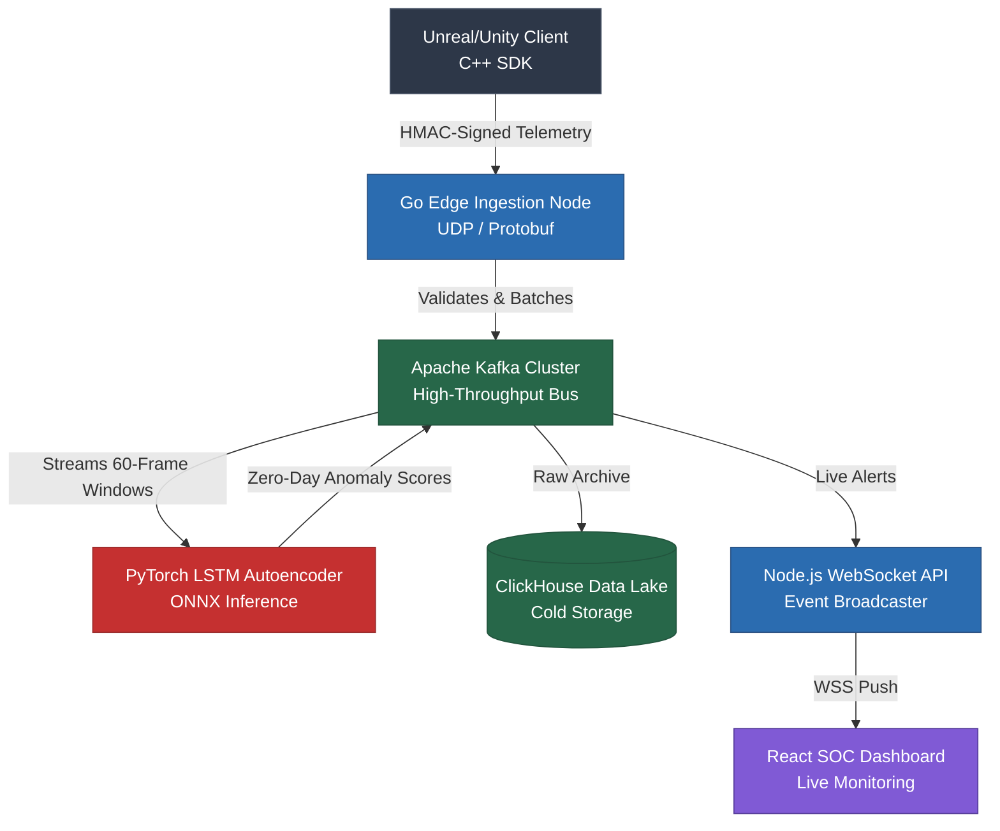

<div align="center">
  
  <h1>SentinX Enterprise Anti-Cheat Architecture</h1>

  <p><strong>Zero-Allocation Native C++ SDK • High-Throughput Go Ingestion • Unsupervised PyTorch ML • Real-Time SOC Dashboard</strong></p>

  <p>
    <a href="https://Vishwajeet2005.github.io/SentinelX/"><b>View Live Interactive Dashboard Demo</b></a>
  </p>

  <p>
    <a href="#overview"></a>
    <a href="#tech-stack"></a>
    <a href="LICENSE"></a>
  </p>
</div>

---

## Executive Summary

**SentinX** is an industry-grade, enterprise-ready Anti-Cheat infrastructure designed specifically for high-concurrency multiplayer environments (Unreal Engine / Unity). 

Engineered from the ground up to guarantee absolute minimal performance impact on the game server, SentinX provides **extreme real-time observability**, **machine-learning-driven zero-day anomaly detection**, and **massive horizontal scalability** to the Security Operations Center (SOC). 

By leveraging an Unsupervised LSTM Autoencoder, SentinX completely abandons traditional "signature-based" ban lists. Instead, it detects mathematically impossible player physics (Aimbots, Speedhacks, Teleports) by learning the latent distribution of legitimate human telemetry and mathematically flagging anomalies in real-time.

---

## Architectural Highlights

### 1. Zero-Allocation C++ Engine SDK
A lockless, ring-buffer driven C++ SDK with an `extern "C"` ABI. Designed to be hooked directly into the game engine's `Tick()` loop. 
* **Performance:** Introduces `< 0.1ms` overhead per frame. 
* **Encryption:** Secures telemetry via **AES-256-GCM** (Encrypt-then-MAC configuration) with a 96-bit randomized IV per packet, preventing man-in-the-middle memory tampering and payload spoofing.

### 2. High-Throughput Go Edge Ingestion
A highly concurrent UDP edge server written in Go `1.23`. Engineered to ingest millions of telemetry packets simultaneously.
* **Defenses:** Native Replay Attack protection, Server-Authoritative Time Dilation enforcement, and dynamic packet-loss interpolation.
* **Observability:** Fully instrumented with Prometheus endpoints for sub-millisecond latency tracking.

### 3. PyTorch ML Pipeline & Deterministic Traps
The core detection engine features a hybrid architecture: an **LSTM Autoencoder** for probabilistic anomalies, paired with deterministic mathematical traps.
* **Deterministic Honeypots:** We spawn invisible entities within the server bounds. If an attacker's ESP (Wallhack) snaps their Euler Angles to the exact coordinates of the invisible honeypot, the PyTorch inference is bypassed and a 100% mathematically proven `WALLHACK_DETECTED` ban is issued instantly.
* **Zero-Day ML Detection:** For everything else, the Autoencoder (trained purely on legitimate human physics) reconstructs the data. Unknown Aimbots or Speedhacks cause the Mean Squared Error (MSE) to skyrocket, triggering an anomaly ban.
* **Performance:** ONNX Graph compilation allows for microsecond inference latency in production Kubernetes clusters.

### 4. Real-Time SOC Dashboard & Data Lake
A stunning, web-based React dashboard featuring a highly professional SaaS aesthetic for the Security Operations Center.
* **Live Feed:** Interfaces via WebSockets to stream a live ML Detection Feed.
* **Analytics:** Visualizes dynamic performance metrics, network health, and regional latency distributions.
* **Command Interface:** Features a functional command terminal for issuing remote hardware bans (`HWID`) in real-time.
* **Storage:** Telemetry is asynchronously archived in Apache Kafka and a ClickHouse columnar database for querying billions of coordinate events in milliseconds.

---

## System Design & Topology



---

## Live Interactive Demo

We have deployed the React SOC Dashboard to GitHub Pages so you can interact with the Security Operations Center firsthand. 

**[Launch the SentinelX Dashboard Demo](https://Vishwajeet2005.github.io/SentinelX/)**

*Note: The live demo runs in an automated "Simulation Mode", generating realistic anomaly payloads and streaming fake telemetry to demonstrate the dynamic UI graphs and real-time alert systems.*

---

## Local Deployment

### Requirements
* Docker & Docker Compose
* Node.js v18+ (For UI Development)

### 1. Bootstrapping the Enterprise Stack
Deploy the complete production stack including Prometheus, Grafana, ClickHouse, and the PyTorch ML Inference Engine:
```bash
# Clone the repository
git clone https://github.com/Vishwajeet2005/SentinelX.git
cd SentinelX

# Spin up the Enterprise Cluster
docker compose -f docker-compose.enterprise.yml up -d --build
```
* **SOC Dashboard:** `http://localhost:3000`
* **Grafana Metrics:** `http://localhost:3001` (admin/admin)
* **Prometheus:** `http://localhost:9090`

### 2. Kubernetes (K8s) Production Deployment
To scale horizontally from 1,000 to 1,000,000 players, deploy the included K8s manifests. This architecture utilizes **Horizontal Pod Autoscaling (HPA)** for the Go Edge Servers (scaling on UDP network CPU load) and PyTorch Inference Nodes (scaling on Memory/OOM protection and CPU).
```bash
./k8s/deploy_local_cluster.sh
```
This script provisions Minikube, metrics-servers for HPA RBAC, cryptographic HMAC secrets, and the stateless node autoscalers.

---

## Why Unsupervised Learning?

Traditional Anti-Cheats rely on **Signature Scanning** (scanning memory for known cheat engine hashes) or **Kernel-Level drivers**. While SentinX does include Ring-0 protections, its primary detection vector is mathematical.

By utilizing an **Unsupervised Autoencoder**, SentinX does not need to know what a cheat looks like. It is trained purely on the latent distribution of *legitimate human gameplay*. When an attacker bypasses the Kernel protections and injects a custom, zero-day Aimbot, the resulting unnatural mouse-movement curve is passed through the neural network. Because the network has never seen this unnatural curve, it fails to compress and reconstruct the data, resulting in a massive spike in the `Reconstruction Error (MSE)`. This mathematically proves the presence of a cheat without ever needing to read the client's memory.

---
<div align="center">
  <p>Built for high-performance multiplayer security.</p>
</div>
