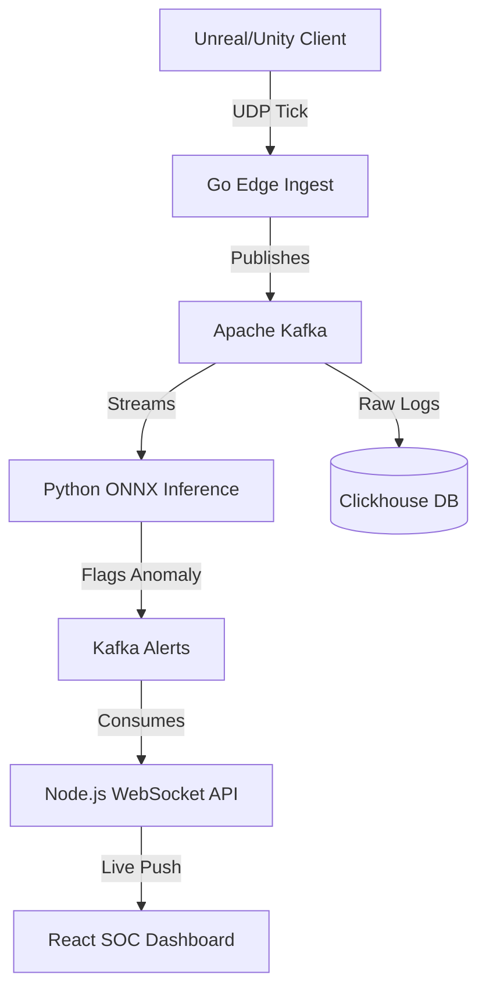

<div align="center">
  <h1>🛡️ SentinX Anti-Cheat Architecture</h1>
  <p><strong>Zero-Allocation Native SDK | High-Throughput Ingestion | Real-Time ML Telemetry | Engine-Native Dashboard</strong></p>
  <p>🚀 <strong><a href="https://Vishwajeet2005.github.io/SentinelX/">View Live Interactive Dashboard Demo</a></strong></p>
</div>

  

## 🌐 Overview
**SentinX** is an industry-grade, enterprise-ready Anti-Cheat infrastructure designed specifically for high-concurrency Unreal Engine and Unity deployments. It is engineered from the ground up for absolute minimal performance impact on the game server, while providing extreme real-time visibility and machine-learning driven anomaly detection to the Security Operations Center (SOC).

**Description:** Enterprise anti-cheat for Unreal/Unity — C++ SDK · Go ingest · Kafka · ClickHouse · ONNX ML

**Topics:** anti-cheat, game-dev, cpp, golang, kafka, onnx, unreal-engine, unity

## 🚀 Key Features

* **Zero-Allocation C++ SDK:** A lockless, ring-buffer driven SDK with an `extern "C"` ABI. Designed to be hooked directly into the Engine's `Tick()` loop. Introduces `< 0.1ms` overhead. Cryptographically signs telemetry via HMAC-SHA256 to prevent spoofing.
* **Go Edge Ingest:** A high-throughput UDP server written in Go designed to ingest millions of telemetry packets simultaneously. Features synthetic frame-interpolation and jitter mitigation.
* **Kafka & Clickhouse Pipeline:** Highly scalable data-streaming and columnar database architecture designed to query billions of coordinate events in milliseconds.
* **Python ONNX Inference:** A decoupled ML inference engine running anomaly-detection heuristics (speedhacks, aim-snapping) over rolling player coordinate traces.
* **Unreal Engine Styled Dashboard:** A custom-built React Native Desktop Editor that interfaces via WebSocket for live 2D Radar mapping of suspected cheaters.

## 📐 Architecture Flow



1. **Client/Server (C++):** Player coordinates (X, Y, Z, Pitch, Yaw) are extracted during the engine tick and pushed to the SentinX Ring Buffer.
2. **Ingest (Golang):** The Ring Buffer is serialized, signed, and blasted over UDP to the Edge Ingest server.
3. **Pipeline (Kafka):** Validated packets are published to Apache Kafka event streams.
4. **Heuristics (Python):** The ONNX ML engine consumes Kafka events, flags statistical anomalies, and publishes Alerts.
5. **Dashboard (React):** The live SOC UI consumes the WebSocket alert stream, instantly visualizing the flagged actor on a 2D topographical mapping space for manual review or automatic termination.

## 🛠️ Implementation Guide

The SDK exposes a native `extern "C"` ABI, allowing seamless integration into any engine.

### Unreal Engine 5 (C++)

Initialize the context in your Dedicated Server when a player connects.
```cpp
#include "sentinx_sdk.h"

void AMyPlayerController::BeginPlay() {
    Super::BeginPlay();
    // Initialize Context with Player ID
    SentinxCtx = sentinx_init(HMAC_SECRET, GetPlayerState()->GetUniqueId());
}

void AMyPlayerController::Tick(float DeltaTime) {
    Super::Tick(DeltaTime);
    SentinxTelemetryFrame Frame;
    Frame.pos_x = GetPawn()->GetActorLocation().X;
    Frame.pos_y = GetPawn()->GetActorLocation().Y;
    // ...
    sentinx_push_telemetry(SentinxCtx, &Frame);
}
```

### Unity 3D (C# via P/Invoke)

Because the SDK is a C-ABI DLL, it hooks natively into Unity using `[DllImport]`.
```csharp
using System.Runtime.InteropServices;

public class SentinXIntegrator : MonoBehaviour {
    [DllImport("sentinx_sdk.dll")]
    private static extern IntPtr sentinx_init(byte[] secret_key, ulong client_id);

    [DllImport("sentinx_sdk.dll")]
    private static extern int sentinx_push_telemetry(IntPtr ctx, ref SentinxTelemetryFrame frame);

    private IntPtr ctx;

    void Start() {
        ctx = sentinx_init(mySecret, SteamID);
    }

    void Update() {
        SentinxTelemetryFrame frame = new SentinxTelemetryFrame();
        frame.pos_x = transform.position.x;
        frame.pos_y = transform.position.y;
        // ...
        sentinx_push_telemetry(ctx, ref frame);
    }
}
```

### UDP Telemetry Serialization
Serialize the signed buffer and blast it to the Go Ingest Edge (`8080`).
```cpp
uint8_t OutBuffer[1024];
int Bytes = sentinx_serialize_payload(SentinxCtx, OutBuffer, 1024);
MyUDPSocket->SendTo(OutBuffer, Bytes, GoEdgeIP, 8080);
```

## 💻 Tech Stack
* **Core SDK:** `C / C++` (C-ABI Compatible)
* **Ingest Edge:** `Golang`
* **Message Broker:** `Apache Zookeeper` / `Apache Kafka`
* **Data Lake:** `Clickhouse`
* **Inference Engine:** `Python` / `ONNX`
* **SOC Dashboard:** `Node.js` (WebSockets) / `React` / `Vite`
* **Containerization:** `Docker` / `Docker Compose`

## ⚙️ Running Locally
The entire stack is containerized for easy deployment and testing.
```bash
docker-compose up -d --build
```
The Dashboard UI will mount to `http://localhost:3000`.
