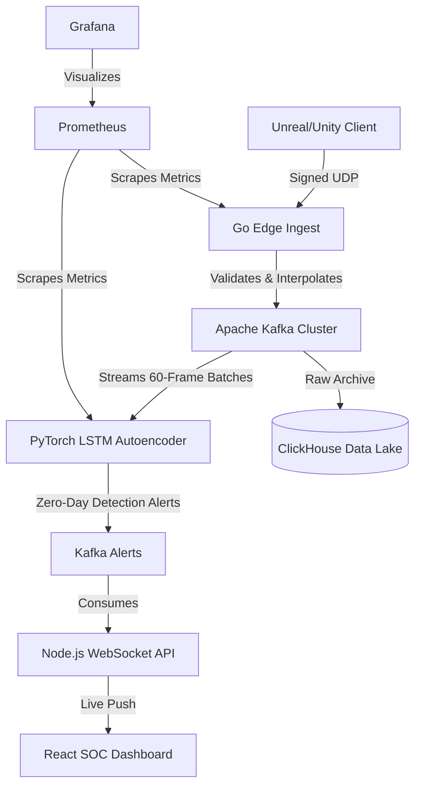

<div align="center">
  <h1>🛡️ SentinX Anti-Cheat Architecture (Enterprise Edition)</h1>
  <p><strong>Zero-Allocation Native SDK | High-Throughput Ingestion | Unsupervised PyTorch ML | K8s Scalability | Real-Time Observability</strong></p>
  <p>🚀 <strong><a href="https://Vishwajeet2005.github.io/SentinelX/">View Live Interactive Dashboard Demo</a></strong></p>
</div>

  

## 🌐 Overview
**SentinX** is an industry-grade, enterprise-ready Anti-Cheat infrastructure designed specifically for high-concurrency Unreal Engine and Unity deployments. Engineered from the ground up for absolute minimal performance impact on the game server, it provides extreme real-time visibility, machine-learning-driven zero-day anomaly detection, and massive horizontal scalability to the Security Operations Center (SOC).

The Enterprise Edition leverages an Unsupervised LSTM Autoencoder to detect unknown cheat signatures (Aimbots, Speedhacks, Teleports) by learning the latent distribution of legitimate human telemetry.

## 🚀 Key Features

* **Zero-Allocation C++ SDK:** A lockless, ring-buffer driven SDK with an `extern "C"` ABI. Designed to be hooked directly into the Engine's `Tick()` loop. Introduces `< 0.1ms` overhead. Cryptographically signs telemetry via HMAC-SHA256.
* **Go Edge Ingestion Node:** High-throughput UDP server written in Go `1.23`. Engineered to ingest millions of telemetry packets simultaneously with native Prometheus observability, Replay Attack protection, and Server-Authoritative Time Dilation defenses.
* **Unsupervised PyTorch ML Engine:** An LSTM Autoencoder trained purely on legitimate human data. Evaluates sliding windows of 60 frames to assign Anomaly Scores (Reconstruction MSE). Actively detects **Lag-Switch Cheat Laundering** via Interpolation Penalty heuristics.
* **Kafka & ClickHouse Data Lake:** Highly scalable data-streaming and columnar database architecture designed to archive and query billions of coordinate events in milliseconds.
* **Enterprise Observability:** Fully instrumented with Prometheus metrics and Grafana dashboards for monitoring telemetry throughput, ML inference latencies, and anomaly detection rates.
* **Kubernetes (K8s) Ready:** Includes production-ready manifests with Horizontal Pod Autoscaling (HPA) for seamless deployment to EKS/GKE.
* **Real-Time SOC Dashboard:** A custom React Native Desktop Editor that interfaces via WebSocket for live 2D Radar mapping of suspected cheaters.

## 📐 Architecture Flow



## 🧠 Unsupervised LSTM Training & Heuristics

The core detection engine is an **Unsupervised PyTorch LSTM Autoencoder** designed to identify mathematical impossibilities in player physics without relying on known cheat signatures.

1. **Training Data:** The model is trained exclusively on synthetic human telemetry (`df[df['label'] == 0]`). It learns the natural bounds of Unreal Engine physics (gravity curves, friction, max acceleration).
2. **Reconstruction MSE:** Because it only knows what "normal" looks like, it attempts to reconstruct sliding 60-frame windows. Legitimate movement reconstructs with an MSE of `~10.0`.
3. **Zero-Day Detection:** When an unknown speedhack, teleport, or violent aim-snap is passed through the network, the LSTM fails to reconstruct the impossible physics curve, causing the MSE to skyrocket to `> 150,000`, immediately triggering a ban threshold.
4. **ONNX Graph Compilation:** The trained PyTorch weights are dynamically traced and exported to a highly optimized `behavior_autoencoder_v1.onnx` file (IR Version 10) for microsecond inference latency in production clusters.

## 🛡️ Security Posture & Defenses

SentinX implements multiple layers of defense against network manipulation and protocol attacks:
1. **Time Dilation Exploit Defense:** The Go Edge server enforces server-authoritative frame deltas, preventing attackers from masking speedhacks by spoofing their timestamp payload.
2. **Cheat Laundering Defense:** The PyTorch ML engine actively tracks artificially interpolated frames (used to repair packet loss). If a client uses a Lag-Switch to hide a violent aimbot snap, SentinX dynamically multiplies their MSE Reconstruction Error, triggering an immediate ban.
3. **Replay Cache Protection:** All incoming packets are hashed via HMAC signatures. Duplicate payloads within the valid sequence variance window are instantly dropped to prevent rubber-banding and state manipulation.

## 💻 Tech Stack
* **Core SDK:** `C / C++` (C-ABI Compatible)
* **Ingest Edge:** `Golang 1.23`
* **Message Broker:** `Apache Zookeeper` / `Apache Kafka`
* **Machine Learning:** `Python` / `PyTorch` / `scikit-learn`
* **Data Lake:** `ClickHouse`
* **Observability:** `Prometheus` / `Grafana`
* **SOC Dashboard:** `Node.js` / `React` / `Vite` / `WebSockets`
* **Infrastructure:** `Docker Compose` / `Kubernetes`

## ⚙️ Deployment

### 1. Local Development Stack
Deploy the minimal stack for testing the SOC Dashboard and SDK integration:
```bash
docker-compose up -d --build
```
* Dashboard UI: `http://localhost:3000`

### 2. Full Enterprise Stack
Deploy the complete production stack including Prometheus, Grafana, ClickHouse, and the PyTorch ML Inference Engine:
```bash
docker compose -f docker-compose.enterprise.yml up -d --build
```
* Grafana Metrics: `http://localhost:3001` (admin/admin)
* Prometheus: `http://localhost:9090`

### 3. Kubernetes (Production)
Apply the K8s manifests to deploy SentinX to a managed Kubernetes cluster with auto-scaling enabled:
```bash
kubectl apply -f k8s/namespace.yaml
kubectl apply -f k8s/secrets.yaml
kubectl apply -f k8s/
```
